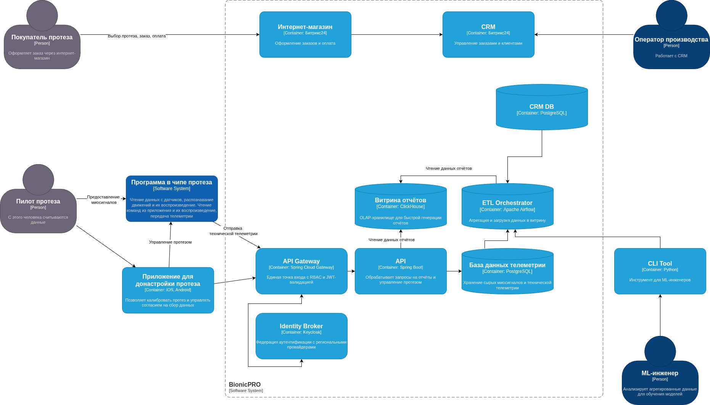

### 1. Поддержка PKCE
Протокол добавляет требование клиенту доказать, что он — это он. 

Для этого используется code_verifier, который, по сути, — ещё один код.
Авторизационный сервер знает, какой функцией будет хешироваться код (она даже может предоставляться при авторизационном реквесте).
Добавление поддержки PKCE реализовано путём добавления опций в конструктор `ReactKeycloakProvider`.

Дополнительно добавлены кнопка выхода и показ полученного отчёта

### C4 диаграмма
